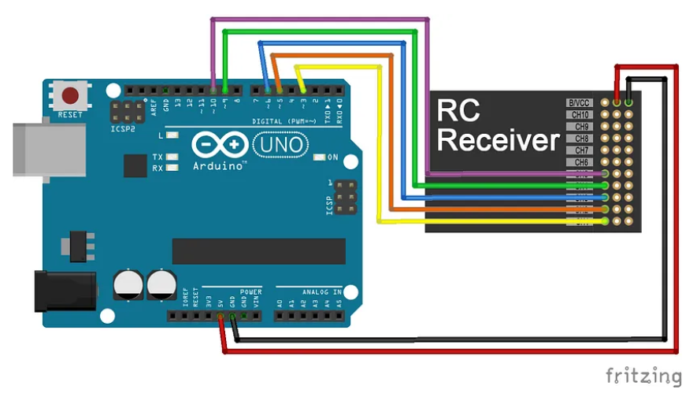
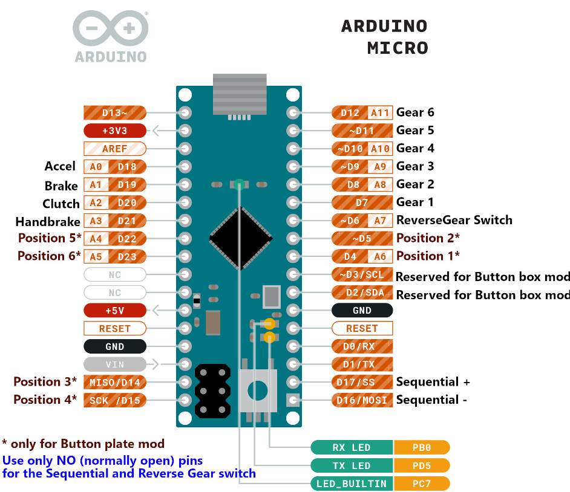
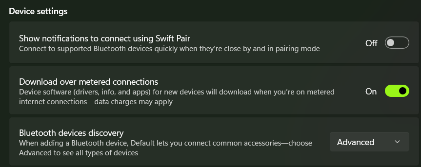
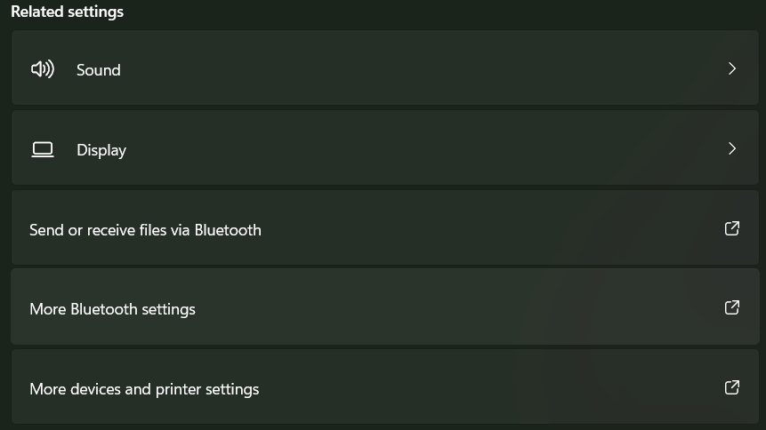
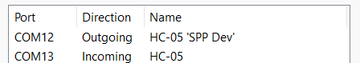

# План

## Все компоненты

1. Управлять с пульта (когда подаём команды с пульта, то машина сначала останавливается - то есть сбрасывается контроль с ПК)

2. Связь с камерой через удлинитель USB (с питанием) - если можно связь через провода, то лучше всегда её делать

## Настройка машинки

У тачки receiver RX-G3, есть 3 канала, у каждого канала есть по 3 пина

* Самый левый - сигнал (соединяется с белым проводом на машине при управлении только с пульта)
* Средний - питание +5V (соединяется с красным проводом на машине при управлении только с пульта)
* Самый правый - ground (соединяется с красным проводом на машине при управлении только с пульта)

Что-то типа такого ([источник](https://medium.com/@werneckpaiva/how-to-read-rc-receiver-signal-with-arduino-54e0447f6c3f)), только не 9 каналов, а 3, и питание и землю подаём для каждого отдельно

<!-- Комментарий, потому что я использую Arduino Uno -->
<!-- Источник - это ШИМ (PWM), на Arduino Micro пины которые поддерживают ШИМ - 3, 5, 6, 9, 10, 11, 13 ([источник](https://forum.arduino.cc/t/pwm-from-pro-micro/618364/2)) -->

Далее описание самого левого пина на каждом из каналов

* На `CH1` - получатель с колёсика на пульте, поворот (steer)
* На `CH2` - получатель с курка на пульте, газ (speed)

<!-- Комментарий, потому что я использую Arduino Uno -->
<!-- Распиновка Arduino Micro (лучше ориентироваться по ней)
 -->

## Настройка Bluetooth на ПК (Windows)

[Видео с подключением модуля и базовым кодом на Python](https://www.youtube.com/watch?v=L3wjZOAyxEE) - это видео, в котором в целом описывается работа с модулем HC-05, который я использую. 

**Важно:** пароль по умолчанию - 1234

Чтобы Bluetooth на ПК увидел модуль на Windows, нужно выбрать `Bluetooth devices discovery -> Advanced`

Далее вниз где `Advanced Settings -> More Bluetooth settings -> COM Ports` и смотрим на `Outgoing` порт для HC-05

У меня на компьютере используется порт `COM13`, поэтому в программе я использую его

**Очень важно:** иногда в окошке `COM Ports` значения портов пропадают - самый простой способ это починить (а я попробовал очень много способов) - перезагрузить компьютер

## Важные моменты, чтобы потом не забыть

1. Когда заливаем программу на Arduino Uno нужно вытащить провода из пинов 0 (RX) и 1 (TX), потому что они общаются по тому же каналу, что и вход на Arduino через USB. **Именно поэтому** если вставить Arduino в компьютер через USB и вытащить провода из 0 и 1 пинов, то можно общаться с Arduino через консоль в Arduino IDE так же, как это впоследствии нужно делать через Bluetooth

2. Каналы 0 (RX - receive) и 1 (TX - transmit) при вставленных провода нужно включать **соответственно** в TXD и RXD каналы Bluetooth модуля (чтобы то, что отправляет Arduino получал модуль Bluetooth и то что отправляет модуль Bluetooth получало Arduino)

3. Очень часто вылетают провода с землёй (GND) - она должна быть общей (соединена) у всех компонент, потому что иначе значения сигналов будут некорректными

4. PWM - широтно импульсная модуляция - какую-то часть периода держится сигнал HIGH, оставшуюся - сигнал LOW, таким образом передаются числовые значения. В среднем значение по каждому каналу (и steer и speed) примерно равно 1500. Не все пины на Arduino умеют работать с ШИМ - на Arduino UNO они помечены значком ~. Это порты 3, 5, 6, 9, 10, 11. Ещё у них разные частоты по умолчанию, которые можно менять ([подробнее](https://alexgyver.ru/lessons/pwm-overclock/)), но использование библиотеки Servo решает эту проблему

5. Для мотора (сервопривод с силой тяги 6 кг) основная частота 3000 Гц, это информация из интернета. Поэтому в коде для Arduino мы выставляем у servo максимальное значение в 3000. Для работы с сервоприводом через PWM используется библиотека Servo, которая по умолчанию уже есть в Arduino IDE - если попытаться вместо неё использовать `digitalWrite`, то работать не будет, потому что он умеет передавать только HIGH и LOW

6. Машинка устроена так, что двигатель должен постоянно питаться - иначе receiver не будет работать совсем

7. Arduino можно питать через `VIN` - пока это не используется и я питаю Arduino Uno от батарейки типа крона на 9 вольт

## Цвета и пины для проводов, чтобы потом не перепутать

Сначала разберёмся с Bluetooth модулем

* Питание 5V от Arduino UNO идёт в VCC на Bluetooth модуле (красный провод)
* GND от Arduino UNO идёт в GND на Bluetooth модуле (чёрный провод)
* 0 (RX) от Arduino UNO идёт в TXD на Bluetooth модуле (синий провод)
* 1 (TX) от Arduino UNO идёт в RXD на Bluetooth модуле (зелёный провод)

Далее нужно соединить ещё одну землю (GND) от Arduino UNO с землёй на Receiver-e - можно использовать любую, поэтому я использую GND от CH3, так как далее он пока всё равно не используется

У receiver-а они все уже соединены между собой - чтобы в этом убедиться их можно **прозвонить** - взять мультиметр, перевести его в режим прозвона - его обозначают динамиком или диодом. Проверить, что включили нужный режим, очень просто - для этого контакты щупов нужно соединить, и прибор издаст характерный звук, а на дисплее отображается нулевое или близкое к нулю значение. Итак, если земли GND соединены между собой, то поставив щупы на разные земли мы услышим характерный звук

Далее нужно соединить пины так, чтобы Arduino мог выступать в роли **прокси** - получать значения с одного пина и сразу же передавать их на другой

* Для поворота - будем получать их с сигнала CH1 receiver-a и передавать на 3 пин Arduino UNO (оранжевый провод, удвоенный) - поэтому в коде для ардуино `#define RC_CH1_INPUT 3`
* Для поворота - будем отдавать сигнал после обработки с 10 пина Arduino UNO на сигнал для поворота, который идёт в управление машинкой (зелёный провод, удвоенный) - поэтому в коде для ардуино `#define RC_CH1_OUTPUT 10`
* Для газа - будем получать их с сигнала CH2 receiver-a и передавать на 6 пин Arduino UNO (жёлтый провод, удвоенный) - поэтому в коде для ардуино `#define RC_CH2_INPUT 6`
* Для газа - будем отдавать сигнал после обработки с 9 пина Arduino UNO на сигнал для газа, который идёт в управление машинкой (синий провод, удвоенный) - поэтому в коде для ардуино `#define RC_CH2_OUTPUT 9`

Удвоенный провод == два провода соединены последовательно (один в другой), так проще программировать, но это совсем необязательно

Всё почти готово, осталось только передавать на питание и землю для поворота и газа (которые идут в управление машинкой) питание и землю с receiver-a. Для этого тоже используются красные провода (для питания) и чёрные провода (для земли)

## Немного про код для Arduino

Если собрать всё правильно и запустить, то можно управлять машинкой через `Serial Monitor` в Arduino IDE (нужно выбрать порт, с которым мы соединились по bluetooth - у меня это `COM13`)

Сами команды состоят из трёх чисел через запятую (без пробелов) - метки времени (при управлении вручную можно всегда делать равной 0), значения поворота и значения скорости. Какие бы значения мы не пытались передавать, они будут схлопнуты в нужный диапазон, поэтому можно смело передавать `0,0,0` и `0,2000,2000`. Чтобы всё остановилось нужно передать значения по умолчанию - `0,1500,1500` вполне подойдёт

Основная сложность в коде - обработка `intervention` - вмешательства с remote (пульта) когда мы пытаемся управлять с помощью bluetooth. В моём коде это реализовано так, что если поступил сигнал с пульта, который отличается от значения по умолчанию на `INTERVENTION_DELTA`, то управление по bluetooth отключается на `INTERVENTION_COOLDOWN_MILLIS` миллисекунд, и в это время можно управлять только с пульта. Если новых команд с пульта в течение `INTERVENTION_COOLDOWN_MILLIS` не поступило, мы снова начинаем принимать команды по bluetooth

Значение печатаются в консоль каждые `PRINT_COOLDOWN_MILLIS` миллисекунд. Отправка по bluetooth при вставленных проводах в 0 (RX) и 1 (TX) делается также как обычная печать в консоль при вставленном USB - с помощью `Serial.println`. Чтение по bluetooth  при вставленных проводах в 0 (RX) и 1 (TX) аналогично делается как чтение из консоли - с помощью `Serial.available()`, которая проверяет получены ли хоть какие-то данные и `Serial.readStringUntil('\n')` для чтения одной строки

Вроде бы я рассказал почти всё, если будет время то сделаю схему в Fritzing
